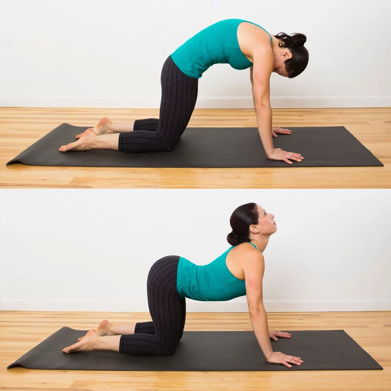
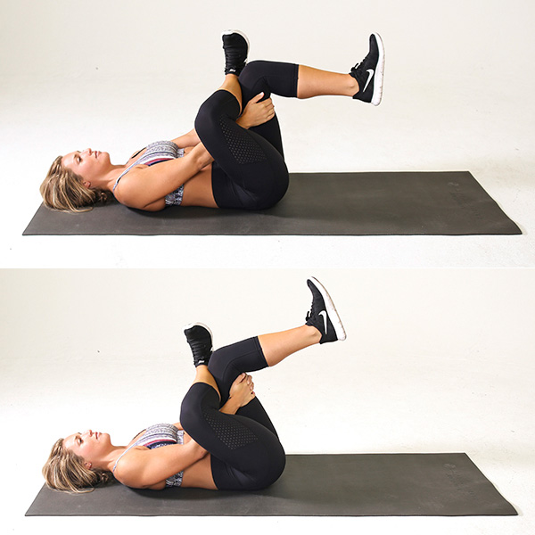
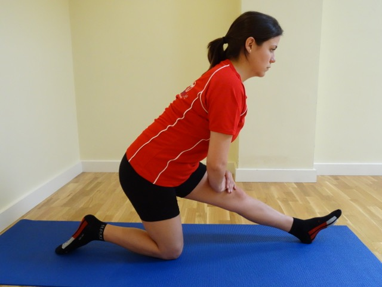
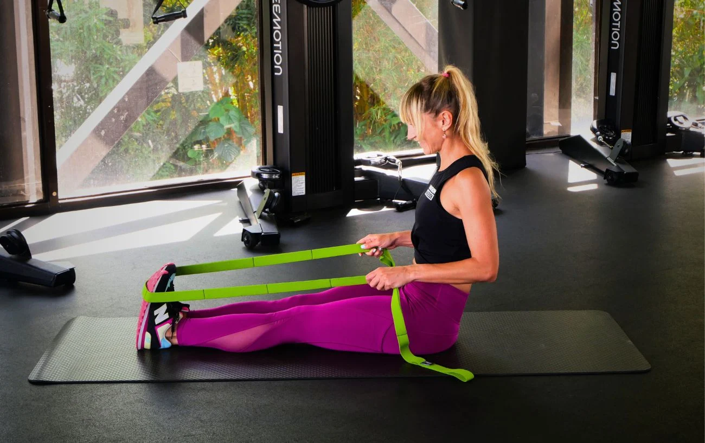
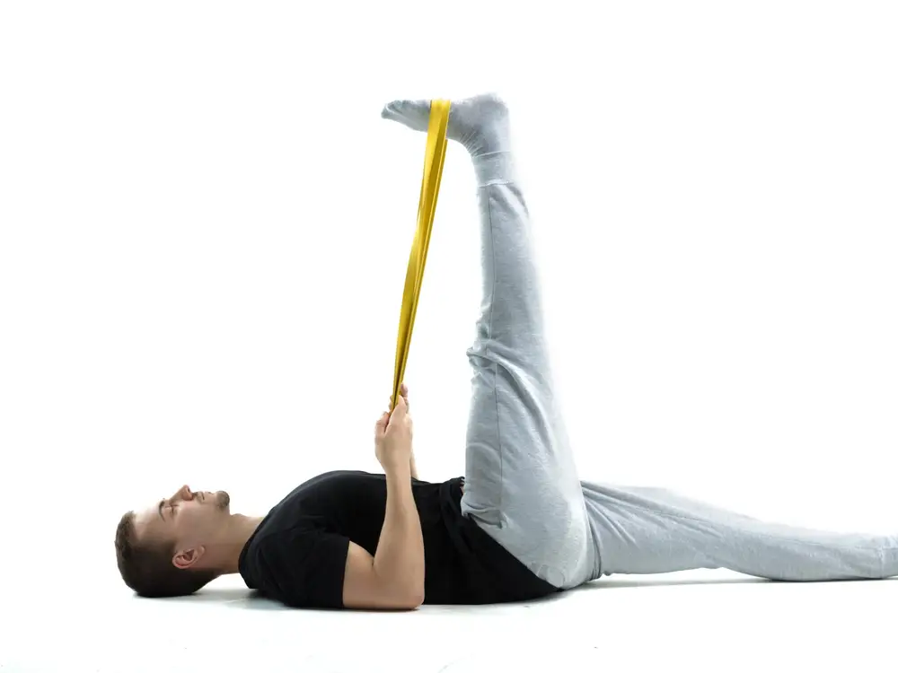
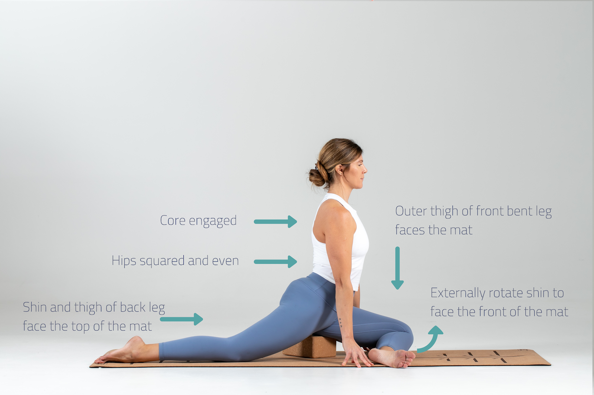
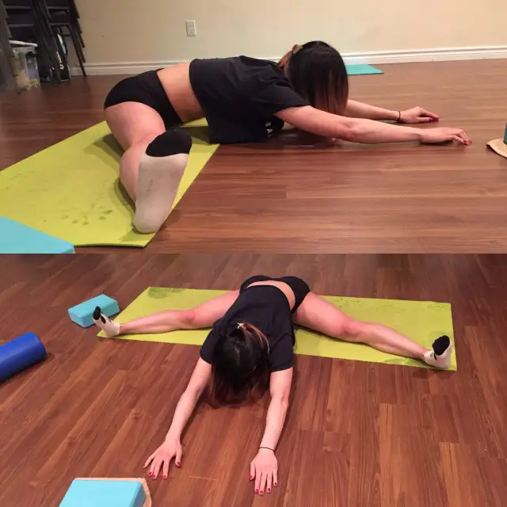
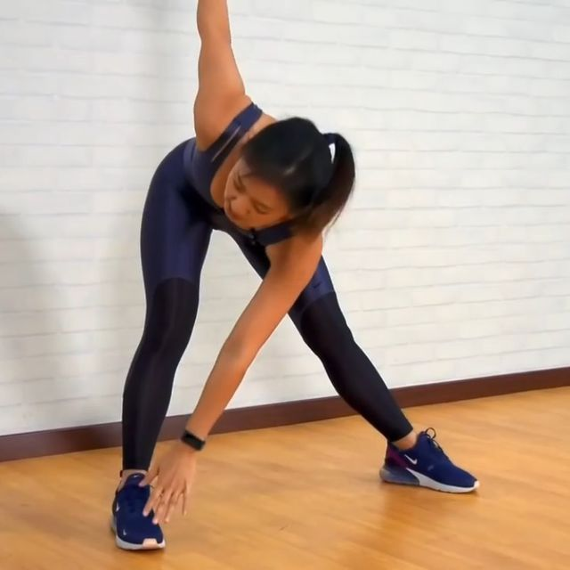
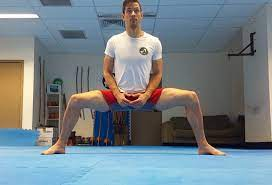

+++
template = "page.html"
title = "Stretches"
slug = "stretches"
+++

Last Updated: January 3 2023

## Goals

This routine was put together to satisfy a couple of goals:
- Do any stretching at all
- Put stretching into my the break periods of my routine
- Develop flexibility with the least reasonable effort.

## Assumptions

I built the routine based on some synthesis Movement By David has done, who suggests that about 5 total minutes per original stretch a week, so I've opted for 2 sets of 30 seconds for stretches, with a one minute rest, assume this stretch and rest duration for all stretches. 2 sets for any arm or leg specific stretches assumes stretching both, of course.

## The Routine

2x Cat-Cow

2x Figure 4 Stretch

2x Kneeling Hamstring Stretch

2x Sitting Toe Reach (w/ resistance band)

2x Lying Hamstring Stretch (with or without band)

2x Pigeon Pose Progression

If this is too easy, work towards King Pigeon

2x Knee over Ankle Stretch

2x Pancake Stretch

2x Windmill Toe Touch

2x Toe Touch

2x Horse Stance Stretch

