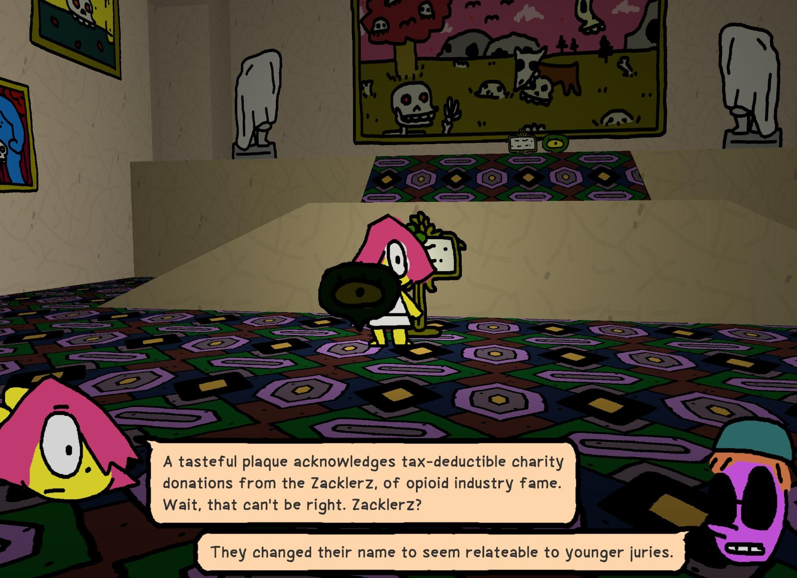

+++
template = "page.html"
title = "Anthology of the Killer, it's good!"
authors = ["goose"]
slug = "thekiller"
date = 2024-12-15
+++

The first time I saw any kind of developer commentary in a game was Gravity Bone. There was a pit full of lights that disappear off into the darkness and the commentary gestured toward a theme park trick where if you're making a similar pit, you can make it look deeper by placing the lights at progressively closer intervals to each other to give it a foreshortening effect. This sticks in my mind, I think, because it gave me one of the ways to think about walking simulators.

It's easy and justifiable to think of walking simulators as purely narrative exercises, but the other thing that they get to play with is architecture. As I settled into Anthology of the Killer, it started to feel like a museum or gallery tour. Dialogue is triggered by a couple of clearly marked symbols, which makes every edition kind of feel like a walk through. Some sequences have urgency, but there are no fail states, which also lends to the overall museum tour feeling.

There are themes in the game that are sticking with me. Anthology of the Killer is an imaginary where murder has become so common that it's aestheticized in every corner of culture. Pop music is by murderers and about murder. Local artists groups have taken over most of the organs of local government and deadly immersive theatre is taking over the town. It's played for a bunch of very good laughs, but it's something that I can't stop thinking about.

I feel like I'm living through a time where the stock of human life is falling. At the moment you're reading this you'll probably have your own examples and a few months from now they'll likely be different from anything I had in mind when I wrote this, but it feels apt! I remember what art was downstream of the post 9/11 forever war, when the devaluation of human life had a single and coherent point, and Anthology remembers too, blending Guantanamo seamlessly into a tapestry of absurd and horror-inflected murder. What happens as the crises multiply, as the objects of dehumanization continue to shift week by week? How does art change, how does that manifest for us?

Remember, the first rule of making zines is don't talk to the police!
